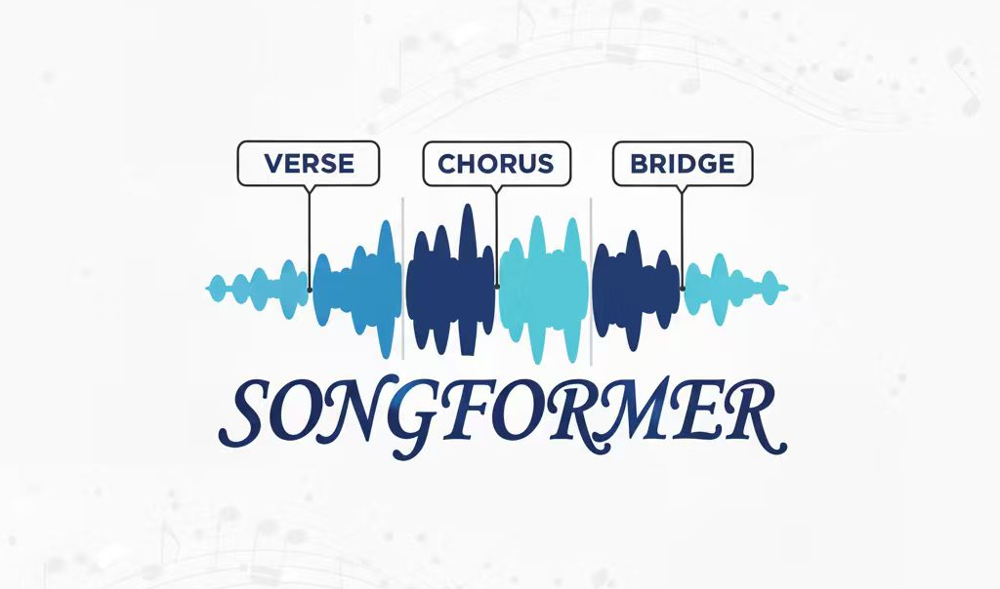
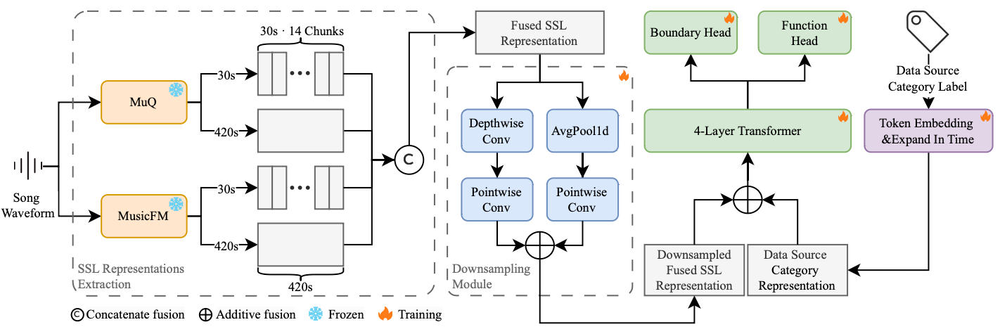

<p align="center">
  
</p>


# SongFormer: Scaling Music Structure Analysis with Heterogeneous Supervision
<p align="center">
  
  
  <a href="https://github.com/ASLP-lab/SongFormer"></a>
  <a href="https://huggingface.co/spaces/ASLP-lab/SongFormer"></a>
  <a href="https://huggingface.co/ASLP-lab/SongFormer"></a>
  <a href="https://huggingface.co/datasets/ASLP-lab/SongFormDB"></a>
  <a href="https://huggingface.co/datasets/ASLP-lab/SongFormBench"></a>
  <a href="https://discord.gg/rwcqh7Em"></a>
  <a href="http://www.npu-aslp.org/"></a>
</p>

Chunbo Hao<sup>&ast;</sup>, Ruibin Yuan<sup>&ast;</sup>, Jixun Yao, Qixin Deng, Xinyi Bai, Wei Xue, Lei Xie<sup>&dagger;</sup>


----


SongFormer is a music structure analysis framework that leverages multi-resolution self-supervised representations and heterogeneous supervision, accompanied by the large-scale multilingual dataset SongFormDB and the high-quality benchmark SongFormBench to foster fair and reproducible research.



## 📢 News and Updates

🔥 **October 3, 2025**  
**Open-sourced Training and Evaluation Code** – We have released the full training and evaluation code to support and promote community development and further research.

🔥 **October 2, 2025**  
**One-Click Inference on Hugging Face Launched** – Successfully deployed our one-click inference feature on the Hugging Face platform, making model testing and usage more accessible and user-friendly.

🔥 **September 30, 2025**  
**SongFormer Inference Package Released** – The complete SongFormer inference code and pre-trained checkpoint models are now publicly available for download and use.

🔥 **September 26, 2025**  
**SongFormerDB and SongFormerBench Launched** – We introduced our large-scale music dataset **SongFormerDB** and comprehensive benchmark suite **SongFormerBench**, both now available on Hugging Face to facilitate research and evaluation in Music structure analysis.

## 📋 To-Do List

- [x] Complete and push inference code to GitHub
- [x] Upload model checkpoint(s) to Hugging Face Hub
- [x] Upload the paper to arXiv
- [x] Fix readme
- [x] Deploy an out-of-the-box inference version on Hugging Face (via Inference API or Spaces)
- [x] Open-source evaluation code
- [x] Open-source training code

## Installation

### Setting up Python Environment

```bash
git clone https://github.com/ASLP-lab/SongFormer.git

# Get MuQ and MusicFM source code
git submodule update --init --recursive

conda create -n songformer python=3.10 -y
conda activate songformer
```

For users in mainland China, you may need to set up pip mirror source:

```bash
pip config set global.index-url https://pypi.mirrors.ustc.edu.cn/simple
```

Install dependencies:

```bash
pip install -r requirements.txt
```

We tested this on Ubuntu 22.04.1 LTS and it works normally. If you cannot install, you may need to remove version constraints in `requirements.txt`

### Download Pre-trained Models

```bash
cd src/SongFormer
# For users in mainland China, you can modify according to the py file instructions to use hf-mirror.com for downloading
python utils/fetch_pretrained.py
```

After downloading, you can verify the md5sum values in `src/SongFormer/ckpts/md5sum.txt` match the downloaded files:

```bash
md5sum ckpts/MusicFM/msd_stats.json
md5sum ckpts/MusicFM/pretrained_msd.pt
md5sum ckpts/SongFormer.safetensors
# md5sum ckpts/SongFormer.pt
```

## Inference

### 1. One-Click Inference with HuggingFace Space

Available at: [https://huggingface.co/spaces/ASLP-lab/SongFormer](https://huggingface.co/spaces/ASLP-lab/SongFormer)

### 2. Gradio App

First, change directory to the project root directory and activate the environment:

```bash
conda activate songformer
```

You can modify the server port and listening address in the last line of `app.py` according to your preference.

> If you're using an HTTP proxy, please ensure you include:
>
> ```bash
> export no_proxy="localhost, 127.0.0.1, ::1"
> export NO_PROXY="localhost, 127.0.0.1, ::1"
> ```
>
> Otherwise, Gradio may incorrectly assume the service hasn't started, causing startup to exit directly.

When first running `app.py`, it will connect to Hugging Face to download MuQ-related weights. We recommend creating an empty folder in an appropriate location and using `export HF_HOME=XXX` to point to this folder, so cache will be stored there for easy cleanup and transfer.

And for users in mainland China, you may need `export HF_ENDPOINT=https://hf-mirror.com`. For details, refer to https://hf-mirror.com/

```bash
python app.py
```

### 3. Python Code

You can refer to the file `src/SongFormer/infer/infer.py`. The corresponding execution script is located at `src/SongFormer/infer.sh`. This is a ready-to-use, single-machine, multi-process annotation script.

Below are some configurable parameters from the `src/SongFormer/infer.sh` script. You can set `CUDA_VISIBLE_DEVICES` to specify which GPUs to use:

```bash
-i              # Input SCP folder path, each line containing the absolute path to one audio file
-o              # Output directory for annotation results
--model         # Annotation model; the default is 'SongFormer', change if using a fine-tuned model
--checkpoint    # Path to the model checkpoint file
--config_pat    # Path to the configuration file
-gn             # Total number of GPUs to use — should match the number specified in CUDA_VISIBLE_DEVICES
-tn             # Number of processes to run per GPU
```

You can control which GPUs are used by setting the `CUDA_VISIBLE_DEVICES` environment variable.

> Notes
> - You may need to modify line 121 in `src/third_party/musicfm/model/musicfm_25hz.py` to:
> `S = torch.load(model_path, weights_only=False)["state_dict"]`

## Evaluation

### 1. Preparing MSA TXT Format for GT Annotations and Inference Results

The MSA TXT file format follows this structure:

```
start_time_1 label_1
start_time_2 label_2
....
end_time end
```

Each line contains two space-separated elements:

- **First element**: Timestamp in seconds (float type)
- **Second element**: Label (string type)

**Conversion Notes:**

- **SongFormer outputs** can be converted using the utility script `src/SongFormer/utils/convert_res2msa_txt.py`
- **Other annotation tools** require custom conversion to this format
- All MSA TXT files should be stored in a folder with **consistent naming** between ground truth (GT) and inference results

### 2. Supported Labels and Definitions

| ID   | Label      | Description                                                  |
| ---- | ---------- | ------------------------------------------------------------ |
| 0    | intro      | Opening section, typically appears at the beginning, rarely in middle or end |
| 1    | verse      | Main narrative section with similar melody but different lyrics across repetitions; emotionally moderate, storytelling-focused |
| 2    | chorus     | Climactic, highly repetitive section that forms the song's memorable hook; features diverse instrumentation and elevated energy |
| 3    | bridge     | Contrasting section appearing once after 2-3 choruses, providing variation before returning to verse or chorus |
| 4    | inst       | Instrumental section with minimal or no vocals, occasionally featuring speech elements |
| 5    | outro      | Closing section, typically at the end, rarely appearing in beginning or middle |
| 6    | silence    | Silent segments, usually before intro or after outro         |
| 26   | pre-chorus | Transitional section between verse and chorus, featuring additional instruments and building emotional intensity |
| -    | end        | Timestamp marker for song conclusion (not a label)           |

**Important Note**: While our model generates 8 categories, mainstream evaluation uses 7 categories. During evaluation, `pre-chorus` labels are mapped to `verse` according to our mapping rules.

### 3. Running the Evaluation

The main evaluation script is located at `src/SongFormer/evaluation/eval_infer_results.py`. You can use the shell script `src/SongFormer/eval.sh` for streamlined evaluation.

#### Parameter Configuration

| Parameter                   | Description                                                  | Default Setting |
| --------------------------- | ------------------------------------------------------------ | --------------- |
| `ann_dir`                   | Ground truth directory                                       | Required        |
| `est_dir`                   | Inference results directory                                  | Required        |
| `output_dir`                | Output directory for evaluation results                      | Required        |
| `prechorus2what`            | Mapping strategy for `pre-chorus` labels:• `verse`: Map to verse• `chorus`: Map to chorus• None: Keep original | Map to `verse`  |
| `merge_continuous_segments` | Merge consecutive segments with identical labels             | Disabled        |

## Training

comming soon

## Citation

If our work and codebase is useful for you, please cite as:

````
comming soon
````
## License

Our code is released under CC-BY-4.0 License.

## Contact Us
We welcome your feedback and contributions! You can reach us through:

- **Report Issues:** Found a bug or have a suggestion? Please open an issue directly in this GitHub repository. This is the best way to track and resolve problems.
- **Join Our Community:** For discussions and real-time support, join our Discord server: https://discord.gg/rwcqh7Em

We look forward to hearing from you!

<p align="center">
    <a href="http://www.nwpu-aslp.org/">
        
    </a>
</p>


