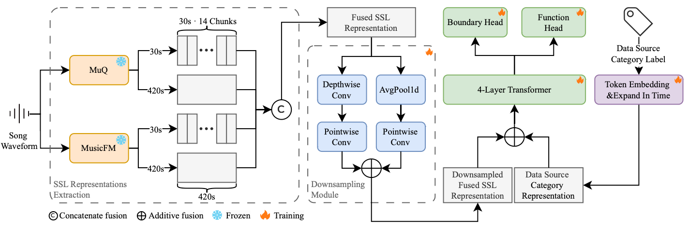

<p align="center">
  
</p>

# SongFormer: Scaling Music Structure Analysis with Heterogeneous Supervision
<p align="center">
  
  
  <a href="https://github.com/ASLP-lab/SongFormer"></a>
  <a href="https://huggingface.co/spaces/ASLP-lab/SongFormer"></a>
  <a href="https://huggingface.co/ASLP-lab/SongFormer"></a>
  <a href="https://huggingface.co/datasets/ASLP-lab/SongFormDB"></a>
  <a href="https://huggingface.co/datasets/ASLP-lab/SongFormBench"></a>
  <a href="https://discord.gg/rwcqh7Em"></a>
  <a href="http://www.npu-aslp.org/"></a>
</p>

Chunbo Hao<sup>&ast;</sup>, Ruibin Yuan<sup>&ast;</sup>, Jixun Yao, Qixin Deng, Xinyi Bai, Wei Xue, Lei Xie<sup>&dagger;</sup>

----
[ [English](README.md) ｜ 中文 ]

SongFormer 是一种音乐结构分析框架，利用多分辨率的自监督表示和异构监督策略，配套发布大规模多语言数据集 SongFormDB 以及高质量基准 SongFormBench，旨在推动音乐结构分析领域的公平与可复现研究。



## 📢 最新动态

🔥 **2025年10月3日**
**开源训练与评估代码** – 我们已发布完整的训练和评估代码，以支持社区发展和进一步研究。

🔥 **2025年10月2日**
**上线 Hugging Face 一键推理功能** – 已成功在 Hugging Face 平台部署 SongFormer 的一键推理功能，使模型测试与使用更加便捷易用。

🔥 **2025年9月30日**
**发布 SongFormer 推理包** – SongFormer 的完整推理代码和预训练模型Checkpoint现已公开发布，可供下载和使用。

🔥 **2025年9月26日**
**发布 SongFormDB 与 SongFormBench** – 我们推出了大规模音乐数据集 **SongFormDB** 和综合评测基准 **SongFormBench**，均已上线 Hugging Face，助力音乐结构分析的研究与评估。

## 📋 待办事项清单

- [x] 完成并推送推理代码至 GitHub
- [x] 上传模型Checkpoint至 Hugging Face Hub
- [x] 上传论文至 arXiv
- [x] 修复 README
- [x] 在 Hugging Face（通过 Inference API 或 Spaces）部署开箱即用的推理版本
- [x] 开源评估代码
- [x] 开源训练代码

## 安装

### 设置 Python 环境

```bash
git clone https://github.com/ASLP-lab/SongFormer.git

# 获取 MuQ 和 MusicFM 源码
git submodule update --init --recursive

conda create -n songformer python=3.10 -y
conda activate songformer
```

中国大陆用户建议配置 pip 镜像源：

```bash
pip config set global.index-url https://pypi.mirrors.ustc.edu.cn/simple
```

安装依赖项：

```bash
pip install -r requirements.txt
```

本项目在 Ubuntu 22.04.1 LTS 上测试通过。若安装失败，可尝试移除 `requirements.txt` 中的部分版本限制。

### 下载预训练模型

```bash
cd src/SongFormer
# 中国大陆用户可根据 py 文件说明修改为 hf-mirror.com 下载
python utils/fetch_pretrained.py
```

下载完成后，可通过以下命令核对 `src/SongFormer/ckpts/md5sum.txt` 中的 MD5 值是否一致：

```bash
md5sum ckpts/MusicFM/msd_stats.json
md5sum ckpts/MusicFM/pretrained_msd.pt
md5sum ckpts/SongFormer.safetensors
# md5sum ckpts/SongFormer.pt
```

## 推理

### 1. 使用 HuggingFace Space 一键推理

访问地址：[https://huggingface.co/spaces/ASLP-lab/SongFormer](https://huggingface.co/spaces/ASLP-lab/SongFormer)

### 2. Gradio 应用

首先切换到项目根目录并激活环境：

```bash
conda activate songformer
```

可按需修改 `app.py` 文件最后一行的服务器端口和监听地址。

> 若使用 HTTP 代理，请确保设置以下环境变量：
>
> ```bash
> export no_proxy="localhost, 127.0.0.1, ::1"
> export NO_PROXY="localhost, 127.0.0.1, ::1"
> ```
>
> 否则 Gradio 可能误判服务未启动，导致程序直接退出。

首次运行 `app.py` 时，会连接 Hugging Face 下载 MuQ 相关权重。建议创建一个空文件夹并通过 `export HF_HOME=XXX` 指向该路径，以便统一管理缓存，便于清理和迁移。

中国大陆用户建议设置：`export HF_ENDPOINT=https://hf-mirror.com`，详情见 https://hf-mirror.com/

```bash
python app.py
```

### 3. Python 代码调用

可参考 `src/SongFormer/infer/infer.py` 文件，对应执行脚本为 `src/SongFormer/infer.sh`。这是一个即开即用的单机多进程标注脚本。

以下是 `src/SongFormer/infer.sh` 脚本中一些可配置参数，可通过设置 `CUDA_VISIBLE_DEVICES` 指定使用的 GPU：

```bash
-i              # 输入SCP文件夹路径，每行包含一个音频文件的绝对路径
-o              # 输出结果目录
--model         # 使用的标注模型，默认为 'SongFormer'，若使用微调模型可在此修改
--checkpoint    # 模型Checkpoint路径
--config_pat    # 配置文件路径
-gn             # 使用的GPU总数 — 应与 CUDA_VISIBLE_DEVICES 中指定的数量一致
-tn             # 每个GPU上运行的进程数
```

可通过设置 `CUDA_VISIBLE_DEVICES` 环境变量控制使用哪些 GPU。

> 注意事项
> - 可能需要修改 `src/third_party/musicfm/model/musicfm_25hz.py` 第121行代码为：
> `S = torch.load(model_path, weights_only=False)["state_dict"]`

## 评估

### 1. 准备 MSA TXT 格式的标注与推理结果

MSA TXT 文件格式如下：

```
start_time_1 label_1
start_time_2 label_2
....
end_time end
```

每行包含两个以空格分隔的元素：

- **第一项**：时间戳（浮点数，单位：秒）
- **第二项**：标签（字符串类型）

**转换说明**：
- **SongFormer 输出结果** 可通过工具脚本 `src/SongFormer/utils/convert_res2msa_txt.py` 进行转换
- **其他工具生成的标注** 需自定义转换为此格式
- 所有 MSA TXT 文件应存放在同一文件夹中，且**文件名需与真实标注（GT）一致**

### 2. 支持的标签及定义

| ID   | 标签         | 描述说明                                                  |
| ---- | ---------- | ------------------------------------------------------------ |
| 0    | intro      | 开头部分，通常出现在歌曲起始，极少出现在中后段 |
| 1    | verse      | 主要叙事段落，旋律相似但歌词不同；情绪平稳，偏叙事性 |
| 2    | chorus     | 高潮部分，高度重复，构成歌曲的记忆点；编曲丰富，情绪高涨 |
| 3    | bridge     | 通常在2-3次副歌后出现一次，提供变化后返回主歌或副歌 |
| 4    | inst       | 纯乐器段落，几乎无或极少人声，偶尔包含语音片段 |
| 5    | outro      | 结尾段落，通常位于歌曲末尾，极少出现在开头或中间 |
| 6    | silence    | 静音段落，通常位于 intro 之前或 outro 之后 |
| 26   | pre-chorus | 主歌与副歌之间的过渡段，加入额外乐器，情绪逐渐增强 |
| -    | end        | 标记歌曲结束的时间戳（非标签类别）           |

**重要说明**：尽管模型输出8个类别，主流评估使用7类标准。在评估时，`pre-chorus` 标签将根据我们的映射规则**统一映射为 `verse`**。

### 3. 执行评估

主评估脚本位于 `src/SongFormer/evaluation/eval_infer_results.py`，可通过 `src/SongFormer/eval.sh` 脚本快速执行评估。

#### 参数说明

| 参数                        | 说明                                                         | 默认设置         |
| --------------------------- | ------------------------------------------------------------ | ---------------- |
| `ann_dir`                   | 真实标注（Ground Truth）目录                                 | 必需             |
| `est_dir`                   | 推理结果目录                                                 | 必需             |
| `output_dir`                | 评估结果输出目录                                             | 必需             |
| `prechorus2what`            | `pre-chorus` 标签映射方式：• `verse`：映射到 verse• `chorus`：映射到 chorus• None：保留原标签 | 映射为 `verse`   |
| `merge_continuous_segments` | 合并连续相同标签的片段                                       | 禁用             |

## 训练

开始之前，请确保已安装必要的依赖项，并正确配置了运行环境。

### 第一步：提取自监督学习（SSL）表示

SSL 表示提取代码位于 `src/data_pipeline` 目录中。首先切换到该目录：

```bash
cd src/data_pipeline
```

对于每首歌曲，您需要提取四种不同的表示：

- **MuQ - 30s**：使用 30 秒窗口的短期特征
- **MuQ - 420s**：使用 420 秒窗口的长期特征
- **MusicFM - 30s**：使用 30 秒窗口的短期特征
- **MusicFM - 420s**：使用 420 秒窗口的长期特征

对于 30 秒的表示，提取过程采用 30 秒的窗口大小和步长（hop size），并在提取后将特征拼接，使其最终序列长度与 420 秒版本一致。

请根据您的环境配置以下脚本，然后运行：

```bash
# MuQ 表示
bash obtain_SSL_representation/MuQ/get_embeddings_30s_wrap420s.sh
bash obtain_SSL_representation/MuQ/get_embeddings.sh

# MusicFM 表示
bash obtain_SSL_representation/MusicFM/get_embeddings_mp_30s_wrap420s.sh
bash obtain_SSL_representation/MusicFM/get_embeddings_mp.sh
```

### 第二步：配置训练参数

编辑 `src/SongFormer/configs/SongFormer.yaml` 文件，设置以下内容：

- `train_dataset`：训练数据集配置
- `eval_dataset`：验证数据集配置
- `args`：模型参数及实验名称

---

针对 `dataset_abstracts` 类，请配置以下参数：

| 参数                   | 说明                                                  |
|------------------------|-------------------------------------------------------|
| `internal_tmp_id`      | 数据集实例的唯一标识符                                |
| `dataset_type`         | 数据集 ID，来自 `src/SongFormer/dataset/label2id.py` 中的 `DATASET_LABEL_TO_DATASET_ID` 映射 |
| `input_embedding_dir`  | 四个 SSL 表示文件夹路径，以空格分隔                   |
| `label_path`           | 包含标签信息的 JSONL 文件路径（参见 [示例格式](https://huggingface.co/datasets/ASLP-lab/SongFormDB/blob/main/data/Gem/SongFormDB-Gem.jsonl)） |
| `split_ids_path`       | 文本文件，每行一个 ID，指定要使用的数据（不在该文件中的 ID 将被忽略） |
| `multiplier`           | 数据均衡因子 —— 重复小数据集以匹配大数据集的规模      |

---

更新 `src/SongFormer/train/accelerate_config/single_gpu.yaml` 中的 accelerate 配置，并相应地配置 `src/SongFormer/train.sh` 脚本：

- 您的 Weights & Biases（wandb）API 密钥
- 其他训练相关设置

### 第三步：启动训练

进入 SongFormer 主目录并运行训练脚本：

```bash
cd src/SongFormer
bash train.sh
```

- 相关的训练仪表板将在 `wandb` 中显示
- 模型检查点（checkpoints）将保存在 `src/SongFormer/output` 目录中

## 引用

如果本项目对您的研究有所帮助，请引用以下内容：

````
即将更新
````

## 许可证

本项目代码遵循 **CC-BY-4.0 许可证**开放。

## 联系我们

我们欢迎您的反馈与贡献！可通过以下方式联系我们：

- **报告问题**：发现 Bug 或有建议？请在本 GitHub 仓库中直接提交 Issue，这是追踪和解决问题的最佳方式。
- **加入社区**：如需讨论或实时支持，欢迎加入我们的 Discord 服务器：https://discord.gg/rwcqh7Em

期待您的来信！

<p align="center">
    <a href="http://www.nwpu-aslp.org/">
        
    </a>
</p>